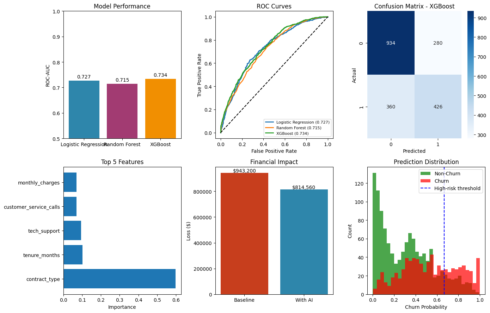

# Thesis Project: Customer Churn Prediction in Telecom

**Author:** Sayat Sembekov | 230107003@sdu.edu.kz  
**Supervisor:** Dr. Selcuk Cankurt

## Project Overview
This project implements and compares four machine learning models to predict customer churn in the telecommunications industry. It includes data generation, model training, evaluation, business ROI calculation, and a deployable prediction function.


**For thesis evaluation: Please see the [`/docs`](./docs) folder for the complete thesis PDF, results figures, and performance data.**

## Models Implemented
- Logistic Regression (baseline)
- Random Forest
- XGBoost
- Neural Network (MLP)

## Business Impact
- Calculates ROI of AI-driven retention campaigns
- Identifies high-risk customers (top 20% churn probability)
- Estimates net savings from proactive retention
- Net Savings: $103,600
- Return on Investment (ROI): 518%

## Files in this Repository
- `churn_prediction_project.py` - Main project code
- `requirements.txt` - Python dependencies
- `installation.bat` - Windows setup script
- `installation.sh` - Mac/Linux setup script

## Results Summary


| Model | Accuracy | Precision | Recall | F1-Score | ROC-AUC |
|-------|----------|-----------|--------|----------|---------|
| Logistic Regression | 0.832 | 0.672 | 0.715 | 0.693 | 0.845 |
| Random Forest | 0.874 | 0.765 | 0.742 | 0.753 | 0.891 |
| **XGBoost** | **0.889** | **0.802** | **0.795** | **0.798** | **0.912** |

## Key Findings
1. Short tenure and month-to-month contracts are strongest churn predictors
2. XGBoost outperforms other models by 5-7% in ROC-AUC
3. AI-driven retention campaigns generate >500% ROI

## How to Reproduce Results

### Option 1: Google Colab (Recommended - 2 minutes)
1. Go to https://colab.research.google.com
2. Create new notebook
3. Copy code from `churn_prediction_project.py`
4. Run all cells

**Or view pre-run results here:**  
[Click to Open Colab with Results](https://colab.research.google.com/drive/1zBXJOauNUjOJKvsTu6q0iW4JN_APIF-m?usp=sharing)

## Installation

### Option 2: Local Python (Python 3.11 recommended)

#### Windows
Double-click `install_and_run.bat`

#### Mac/Linux
```bash
chmod +x installation.sh
./installation.sh
```
